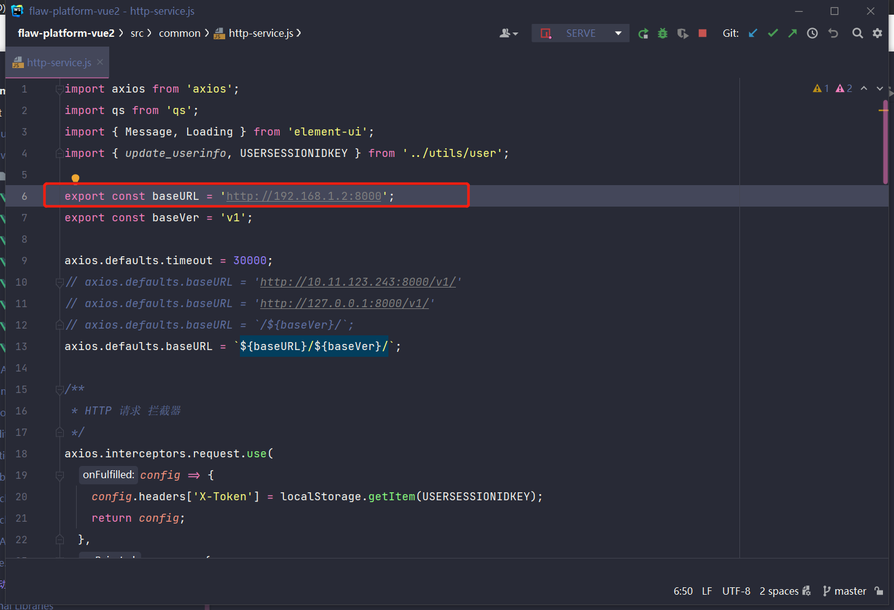

# FlawPlatform 漏洞靶场比赛专版 前端

交流群 [FlawPlatform 漏洞平台交流: 915098601](https://jq.qq.com/?_wv=1027&k=89lUa1mu)

特别说明, 本作品 前端[FlawPlatformMatchVue](https://github.com/S2eTo/FlawPlatformMatchVue), 后端[FlawPlatformMatch](https://github.com/S2eTo/FlawPlatformMatch)可开源使用，但必须免费提供使用。用于任何形式的商务/盈利活动，请提前联系交流群群主。

# 一 

使用 VueJs 2 开发

## 二、初始化

### 2.1 安装所需 node modules
```
npm install
```

### 2.2 配置说明

#### 2.2.1 修改后端API 地址

*src/common/http-service.js* 中修改后端的地址。



#### 2.2.1 修改后端API 地址


### 2.3 编译并启动热加载开发环境

```
npm run serve
```

### 2.4 编译压缩
```
npm run build
```

### 2.5 检测修复文件
```
npm run lint
```
